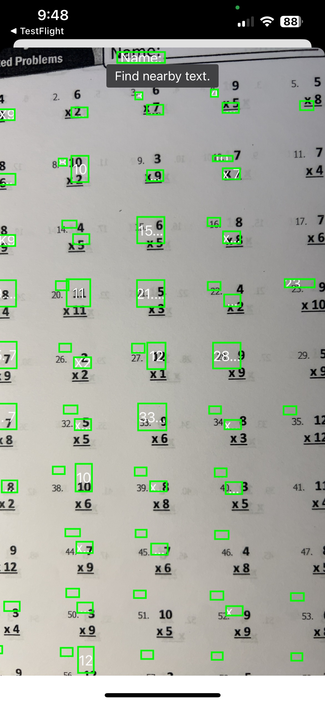

# ScanLiveText

## Background
My sweet daughter(a second grader) often asked me to check her math homework.
That made me think If I can develop a camera app to check the result. 

## Goal
This app can extact the numbers and operators(+/-/*) from the column math
sheets and do the math and then display the indicator which are correct and
which are not. 

## Implementation
Since I use an iPhone it's convinient to make iphone app than Android, but I
had no experience of iphone app development. After some research I decided to
use Claude 3.5 to generate the codebase with Apple's framework VisionKit, I'd
been chatting back and forth with it, and I got it up and running on iphone
simulator, then set up an account to become an Apple Developer Program member,
so I can be able to push my app to apple store, downloaded it with testFlight
and tested it working on my physical iPhone. It's really impressive how quickly
to get a simple app working with the help of AI, it's exiting! Then I started
to tailor it to my specific needs by asking Claude to make changes, this was
when the frustration came, I got build errors, and asked Claude to make chenges
to fix this, then got another error, I couldn't get out of the loop for a
while, I decided to step back to read the developer documents and played around
Swift language and get some level of confidence about Swift language, UI 
framework and VisionKit. I regenerated the codebase with Claude, fixed issues,
tested how much accuracy VisionKit could extrac text from live camera at the 
present, unfortunately it's not accurate enough to meet my goal. So I stopped
here. The final iteration was to simply display the regonized text with the 
green rectangle.

## Result
This app displays the regonized text with the green rectangle.

<!--  -->

